# Referências visuais — Respeitável Público

Criadas em 01/10/2026 com a ferramenta integrada de geração de imagens. 12 pranchas: 9 fases dos 3 chefões, barraca e Camarim, todos os 17 itens da Área 1 e as mecânicas de combate.

Base documental: [Chefões](docs/bosses.md), [Loja](docs/shop.md) e [Combate](docs/combat.md).

São estudos visuais. Não houve implementação no projeto. A meta de 60 FPS e a adaptação por qualidade serão verificadas na Godot quando a implementação for solicitada. Valores da tela de nota são exemplos visuais; as fórmulas e o balanceamento continuam sujeitos a testes.

## Índice

- [O Domador e Leopoldo — três fases](docs/referencias/chefao_domador.png)
- [Os Irmãos Malabaristas — três fases](docs/referencias/chefao_malabaristas.png)
- [O Grande Mágico Zaratan — três fases](docs/referencias/chefao_magico.png)
- [Barraca de Curiosidades e Camarim](docs/referencias/loja_barraca_camarim.png)
- [Pistolas — Rolha, Leque de Confete, Clave de Malabares, Bolha de Sabão](docs/referencias/itens_pistolas.png)
- [Truques — Cambalhota, Fumaça do Mágico, Bala de Canhão, Pirueta](docs/referencias/itens_truques.png)
- [Adereços — Coração de Pano, Nariz de Buzina, Luvas de Mímico, Sapatos de Mola, Trevo da Cartomante](docs/referencias/itens_aderecos.png)
- [Números de dupla — Catapulta, Rolha Turbinada, Pirâmide Humana, Rede de Segurança](docs/referencias/itens_numeros_de_dupla.png)
- [Parry e Número Perfeito](docs/referencias/combate_parry.png)
- [Vida, Balão e Resgate — legenda de retorno corrigida para 1 PV](docs/referencias/combate_balao_resgate.png)
- [Tiro EX, Grandes Números e especial em dupla](docs/referencias/combate_especial.png)
- [Cartaz de vitória e nota da dupla](docs/referencias/combate_cartaz_vitoria.png)

## Chefões

### O Domador e Leopoldo — três fases

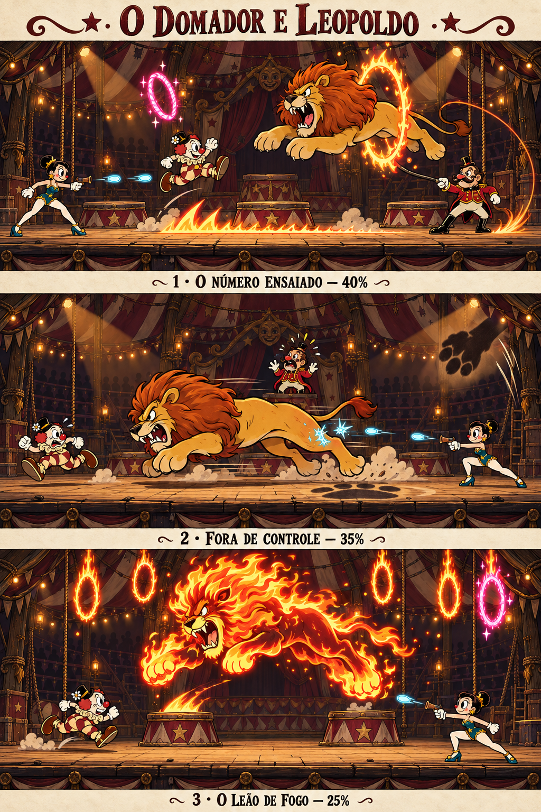

### Os Irmãos Malabaristas — três fases

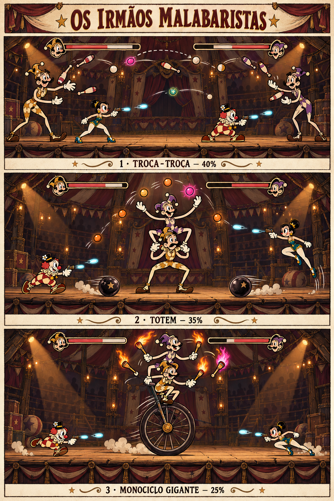

### O Grande Mágico Zaratan — três fases

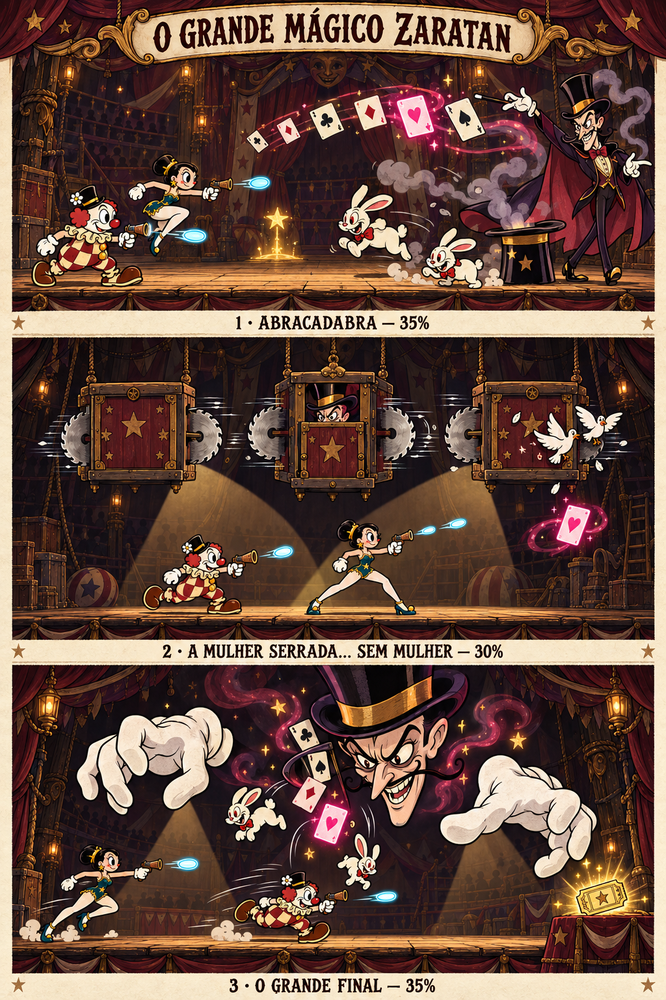

## Loja

### Barraca de Curiosidades e Camarim

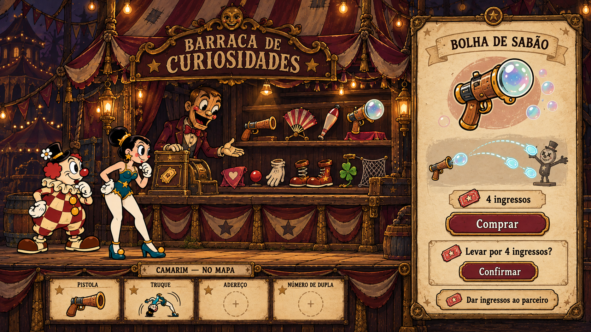

### Pistolas — Rolha, Leque de Confete, Clave de Malabares, Bolha de Sabão

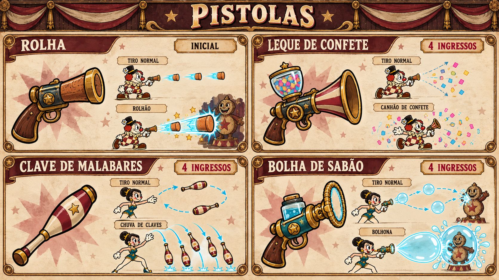

### Truques — Cambalhota, Fumaça do Mágico, Bala de Canhão, Pirueta

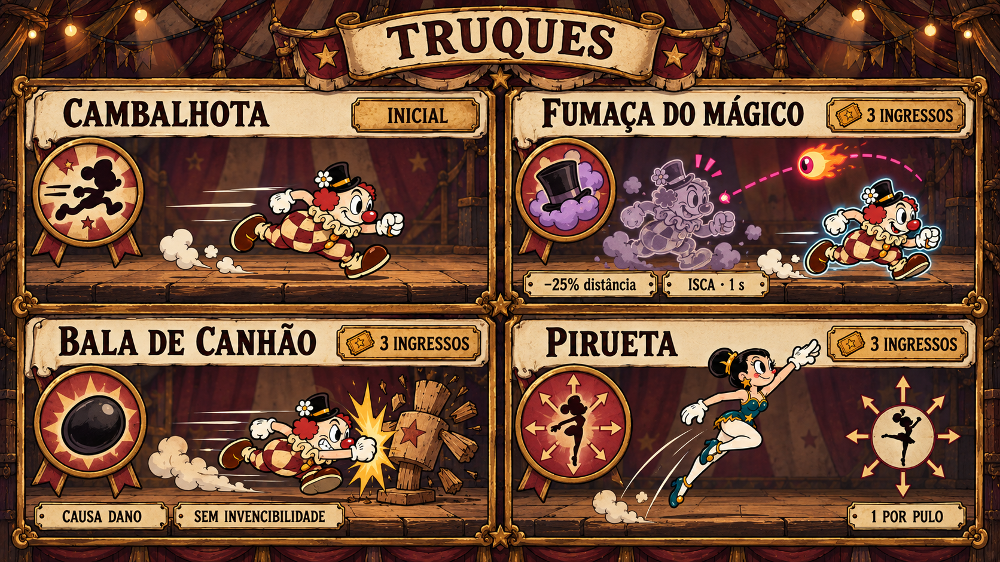

### Adereços — Coração de Pano, Nariz de Buzina, Luvas de Mímico, Sapatos de Mola, Trevo da Cartomante

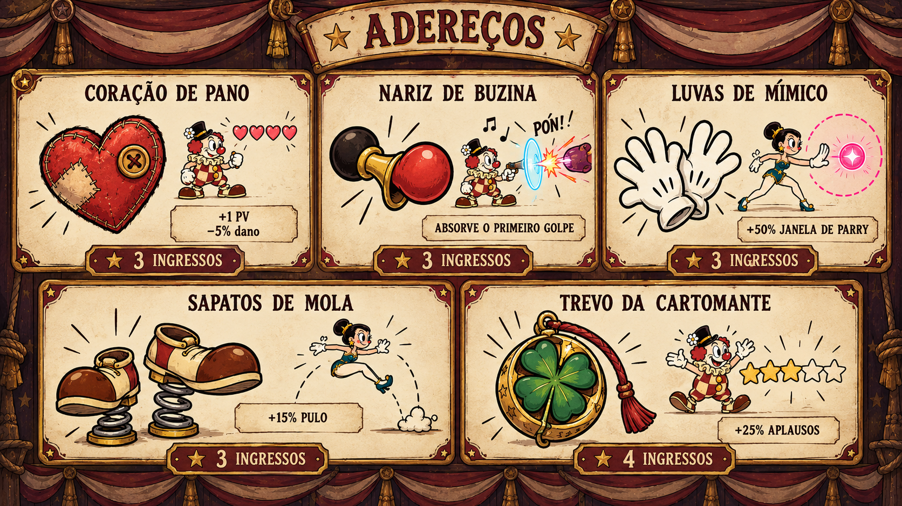

### Números de dupla — Catapulta, Rolha Turbinada, Pirâmide Humana, Rede de Segurança

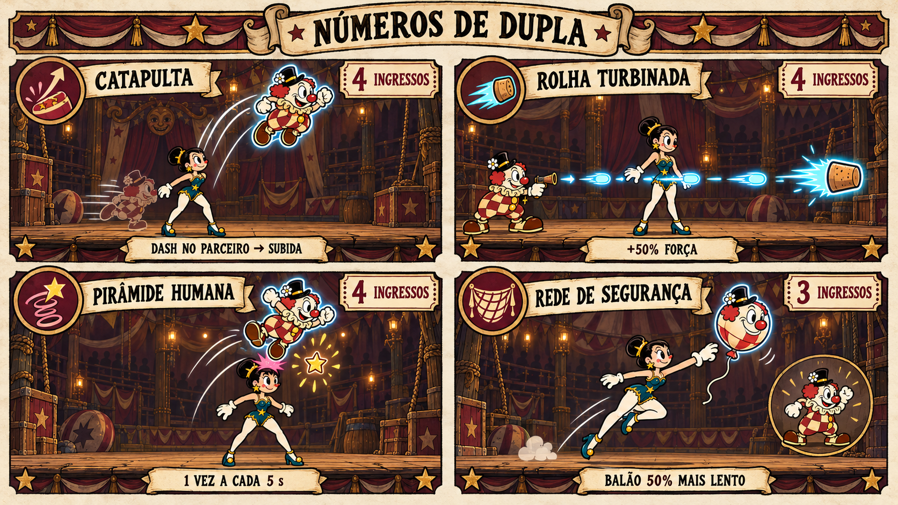

## Combate

### Parry e Número Perfeito

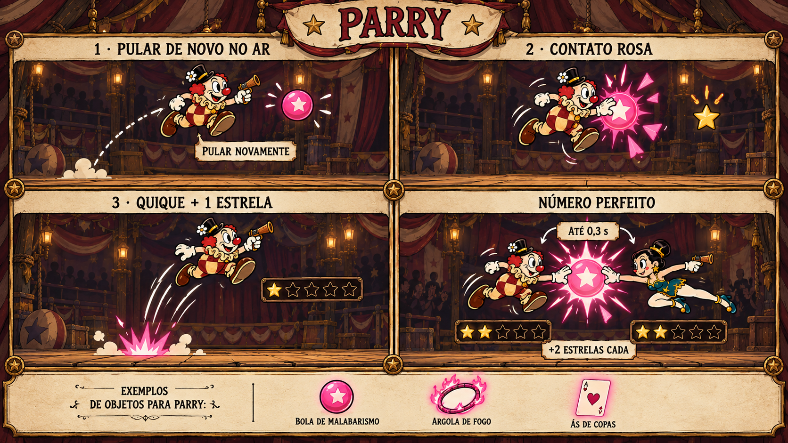

### Vida, Balão e Resgate — legenda de retorno corrigida para 1 PV

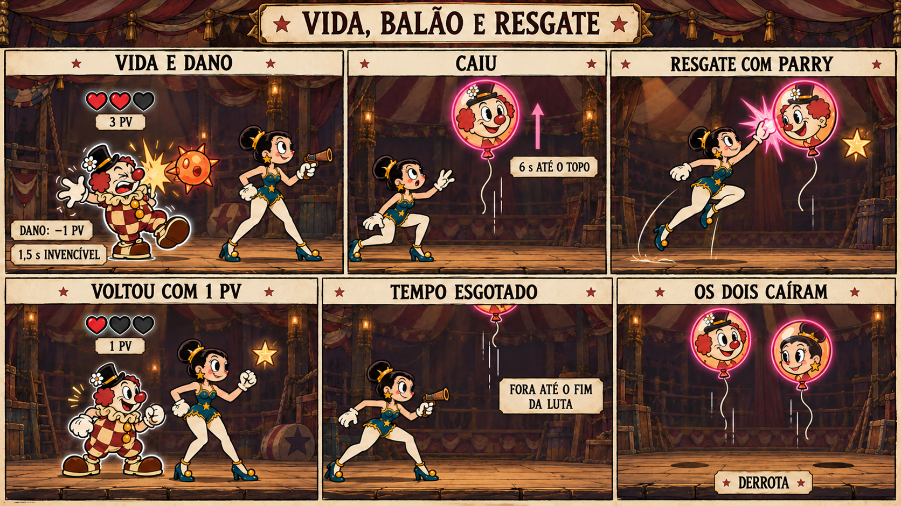

### Tiro EX, Grandes Números e especial em dupla

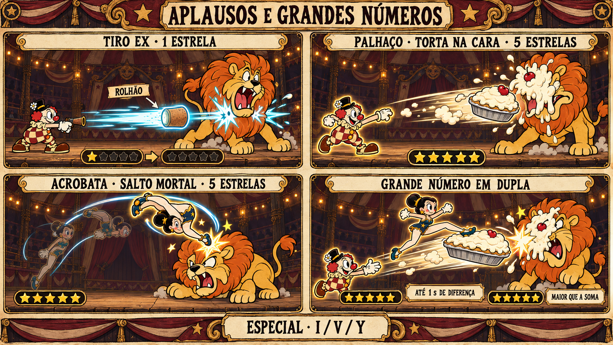

### Cartaz de vitória e nota da dupla

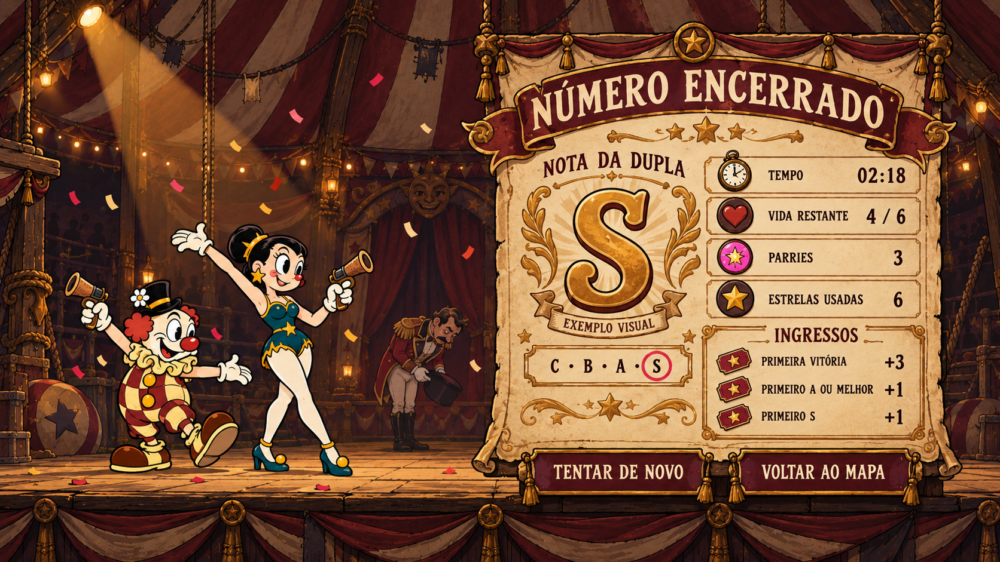

## Direção visual inicial aprovada

[Arena de circo](docs/referencias/direcao_arena.png) e [poses dos personagens](docs/referencias/direcao_personagens.png).

