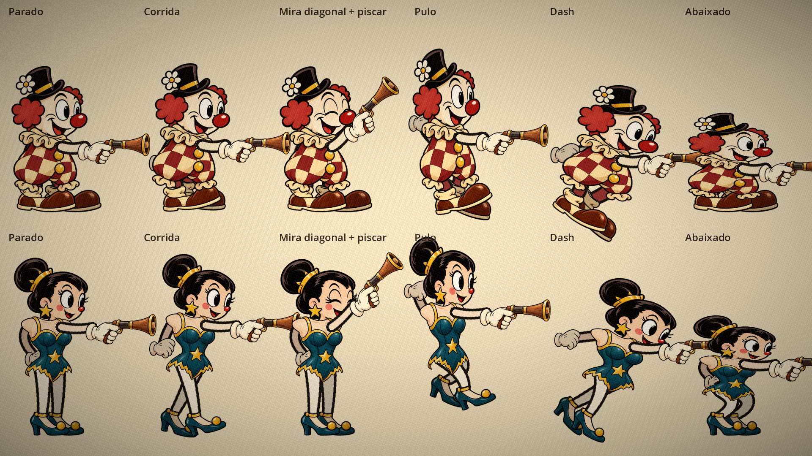

# Peças ilustradas dos personagens

O palhaço e a acrobata usam peças ilustradas em PNG com transparência, montadas e animadas pelo `CharacterRig` (o mesmo sistema de antes: braços e pernas "de mangueira" desenhados por código).



## De onde vêm as peças

As folhas ilustradas originais (fundo transparente) ficam em `docs/referencias/pecas/`:

| Arquivo | Conteúdo |
|---|---|
| `palhaco_folha.png` | cabeça, cabeça piscando, tronco, sapato e luva fechada do palhaço |
| `acrobata_folha.png` | cabeça, cabeça piscando e sapato da acrobata |
| `acrobata_tronco.png` | tronco da acrobata (collant com pescoço, sem braços), gerado no mesmo ângulo 3/4 da cabeça |
| `luva_pistola.png` | luva segurando a pistola de rolha (compartilhada) |

Os prompts usados para gerar as folhas estão em [personagens-prompts.json](personagens-prompts.json).

## Como as peças são recortadas

`tools/cut_character_parts.gd` recorta cada peça da folha e salva o PNG na pasta do personagem:

- **Escala uniforme**: a peça nunca é esticada só na largura ou só na altura (a primeira versão distorcia cabeça, sapatos e luva).
- **Resolução 2x**: a textura tem o dobro do tamanho com que aparece no jogo e o `Sprite2D` usa escala 0,5. Fica nítido em tela cheia e continua leve (cerca de 420 KB as dez peças).
- O piscar usa exatamente a escala da cabeça, para os dois se sobreporem sem "pular".

Para trocar uma peça: substituir a folha em `docs/referencias/pecas/` (ou ajustar a região em `PARTS`) e rodar:

```
Godot --headless --script res://tools/cut_character_parts.gd
```

## Encaixe na cena

Cada rig (`clown_rig.tscn`, `acrobat_rig.tscn`) define onde cada peça encosta:

- **Cabeça**: o ponto do nó é a base do pescoço. No palhaço o pescoço fica atrás da gola (cabeça desenhada antes do tronco); na acrobata o tronco já tem pescoço e a cabeça é desenhada por cima dele.
- **Ombros e quadris**: marcadores `ShoulderBack/Front` e `HipBack/Front` sobre o desenho do tronco.
- **Pernas**: a perna da frente (desenhada por cima) fica à esquerda e a de trás à direita. Como o personagem olha para a direita em 3/4, o bico do sapato da frente passa por cima do calcanhar do sapato de trás.
- **Luva com pistola**: o ponto do nó é o pulso; o marcador `Muzzle` fica na boca do cano.

Para conferir o encaixe depois de mexer: rodar `tools/preview_characters.gd` com janela (não headless), passando a pasta onde salvar a imagem e, opcionalmente, `clown` ou `acrobat` para ver um só personagem ampliado:

```
Godot --script res://tools/preview_characters.gd -- <pasta> [clown|acrobat]
```

## Animações quadro a quadro (teste com a corrida do palhaço)

Desde 02/10/2026 o rig aceita animações desenhadas quadro a quadro. Enquanto uma delas toca, o
corpo de peças some e entra o desenho; **o braço da arma continua por código**, preso ao ombro
de cada quadro, então a mira em 8 direções e o recuo do tiro funcionam igual.

- Folha de origem: `docs/referencias/pecas/palhaco_corrida.png` (grade 4 × 2, células de 512 px,
  fundo transparente, chão na mesma linha em todas as células, sem o braço da frente).
- `tools/cut_animation_sheet.gd` recorta a folha (mesmo retângulo para todos os quadros, para
  manter o pulinho desenhado), reduz para 75% e gera `core/player/characters/clown/run/run.tres`
  (um `FrameAnimation` com os quadros, a escala, a posição e o ombro de cada quadro).
  O ombro é achado pelo nariz vermelho + um deslocamento medido uma vez por personagem.
- No rig: `run_animation` aponta para o `.tres`. Vazio = corrida com as peças (como a acrobata hoje).
- Peso: 8 quadros ≈ 830 KB.

Para as próximas folhas, pedir também: **o braço livre sempre atrás do corpo** (na corrida atual
ele às vezes passa na frente do peito, ao lado da mão com a arma) e **a mesma escala e linha do
chão** da folha da corrida.
